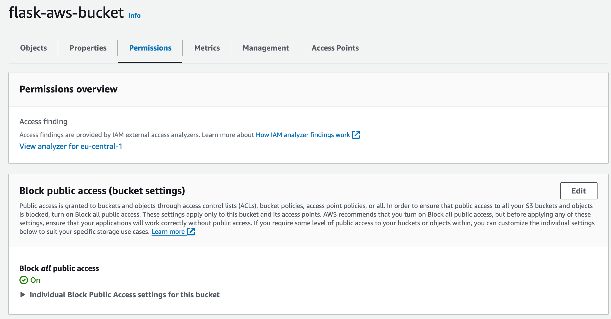

### Project Description
This project involves deploying a Flask application on an AWS EC2 instance using Docker and Docker Compose.
The setup includes creating an EC2 template with Ubuntu 22.04, installing Docker and Docker Compose, and configuring necessary environment variables. 
Additionally, it involves setting up an Auto Scaling Group to manage the application's load dynamically and a Load Balancer to ensure seamless access on port 5555.
The final deployment ensures a scalable and balanced Flask application environment.

### 1. Create EC2 Template

- **Operating System**: Ubuntu 22.04
- **Instance Type**: t2.micro
- **Security Group**: Allow inbound traffic on ports 22 (SSH), 80 (HTTP), and 5555 (application).
- **IAM Role**: Assign the S3ReadOnlyAccess permission to the instance role
- **User data**:
    ```bash
    #!/bin/bash

    # Clone the project repository
    git clone https://github.com/waleed399/flask-aws.git

    # Update package lists and install Docker
    sudo apt-get update
    sudo apt-get install docker.io -y

    # Start Docker service
    sudo systemctl start docker

    # Install Docker Compose
    sudo curl -L "https://github.com/docker/compose/releases/download/1.29.2/docker-compose-$(uname -s)-$(uname -m)" -o /usr/local/bin/docker-compose
    sudo chmod +x /usr/local/bin/docker-compose
    docker-compose --version

    # Navigate to the project directory
    cd flask-aws

    # Set up environment variables in .env file
    echo "MONGO_URI=YOUR_MONGO_CONNECTION_STRING" >> .env
    echo "S3_BUCKET_NAME=YOUR_BUCKET_NAME" >> .env
    echo "S3_OBJECT_KEY=YOUR_OBJECT_NAME" >> .env
    echo "REGION=YOUR_REGION" >> .env

    # Start the application
    sudo docker-compose up --build
    ```
# Make sure your S3 AWS Bucket is private by editing the permissions:

### 2. Create Auto Scaling Group

- To test your Auto Scaling, connect to your EC2 instance and run the following command:
    ```bash
    sudo apt-get install stress-ng
    stress-ng --cpu $(nproc) --timeout 5m --metrics-brief
    ```

### 3. Create Load Balancer

- Don't forget to connect it with the correct port (in our app, it's 5555).

### 4. Final Results

- Your application is now fully deployed with auto-scaling and load balancing.

## Another Easier way to deploy the application is by creating EC2
## These steps can be used if you dont want to create an autoscaling group and LoadBalancer and just run the application on EC2 !
# 🐍 Flask AWS Deployment Guide

This guide will help you deploy your Flask application on an EC2 instance using Docker and Docker Compose.


## Prerequisites

- 🌐 AWS account
- 🧠 Basic knowledge of AWS EC2, Docker, and Docker Compose

## Steps to Deploy

### 1. Launch EC2 Instance

1. Open the [AWS Management Console](https://aws.amazon.com/).
2. Sign in to the AWS console
3. In the search bar, type `EC2` and select it.
4. Click on `Launch Instance`.

### 2. Configure Instance Details

4. **Name and Tags**: Enter a name for your instance.
5. **Application and OS Images (AMI)**: Select `Ubuntu` as the OS and choose `Ubuntu Server 22.04 LTS (free tier)`.
6. **Instance Type**: Choose `t2.micro`.

### 3. Configure Key Pair

7. Click on `Create new key pair`.
8. Enter a name for your key pair, keep everything as default, and click `Create`.

### 4. Configure Network Settings

9. In the network settings section, click `Edit`.
10. Click on `Create new security group`.
11. Check the boxes for `Allow HTTP traffic` and `Allow SSH traffic`.
12. Click on `Add security group rule`.
13. Set the following values:
    - **Type**: Custom TCP
    - **Port range**: 5555
    - **Source type**: Anywhere
14. Click `Launch instance`.

### 5. Connect to Your Instance

15. Go to your EC2 dashboard, select the instance you just created, and click `Connect` (twice) until the command console opens.

### 6. Clone the Repository

17. Once inside the EC2 instance, run the following command to clone the repository:
    ```bash
    git clone https://github.com/waleed399/flask-aws.git
    ```
18. Change directory to the project folder:
    ```bash
    cd flask-aws
    ```

### 7. Install Docker

19. Run the following commands to install Docker (this may take a couple of minutes!):
    ```bash
    sudo apt update
    sudo apt-get install docker.io -y
    sudo systemctl start docker
    ```

### 8. Install Docker Compose

20. Run the following commands to install Docker Compose:
    ```bash
    sudo curl -L "https://github.com/docker/compose/releases/download/1.29.2/docker-compose-$(uname -s)-$(uname -m)" -o /usr/local/bin/docker-compose
    sudo chmod +x /usr/local/bin/docker-compose
    docker-compose --version
    ```

### 9. Create Environment Configuration File

21. Since the application uses MongoDB, you need to create a `.env` file with the necessary configurations:
    ```bash
    nano .env
    ```
    Add the following content to the `.env` file:
    ```
    MONGO_URI="YOUR_MONGO_CONNECTION_STRING"
    S3_BUCKET_NAME="YOUR_BUCKET_NAME"
    S3_OBJECT_KEY="YOUR_OBJECT_NAME"
    REGION="YOUR_REGION"
    ```
    Save and exit the `.env` file.
    
    You can connect it to your MongoDB cluster with the correct `MONGO_URI` and add your own AWS S3 bucket details.

### 10. Deploy the Flask Application

22. Run the Docker Compose command inside the EC2 instance:
    ```bash
    sudo docker-compose up
    ```

### 11. Access Your Flask Application

23. Your Flask app is now up and running. You can access it through the following URL:
    ```
    http://YOUR_INSTANCE_IP:5555
    ```

## 🎉 Conclusion

You've successfully deployed your Flask application on an EC2 instance using Docker and Docker Compose. Happy coding!

---

Feel free to reach out if you have any questions or need further assistance.


